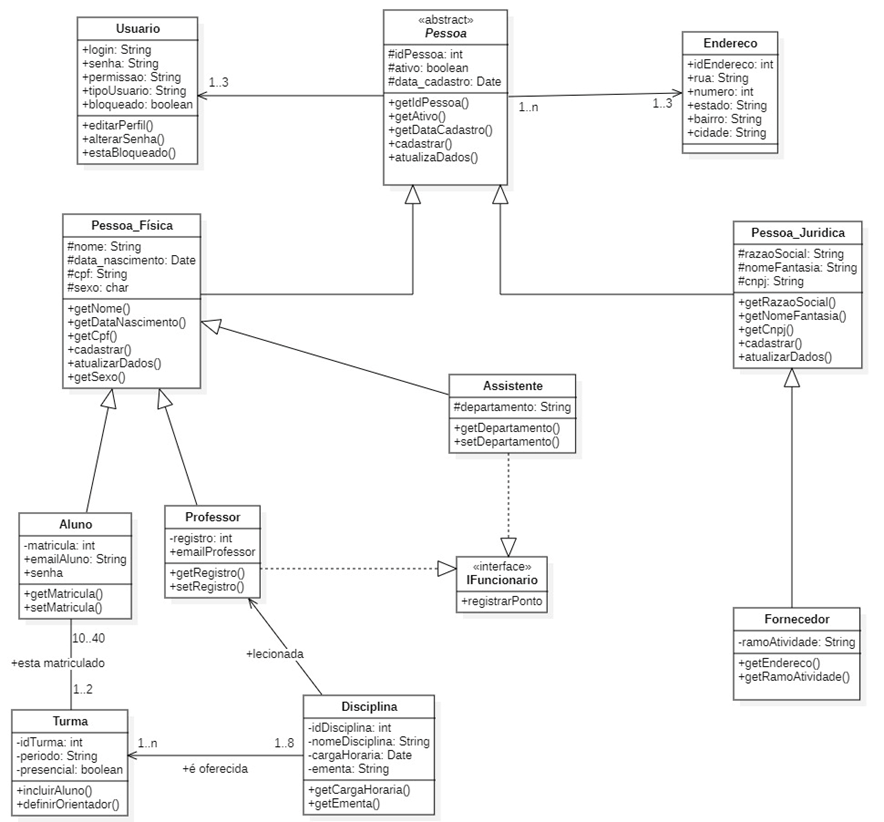
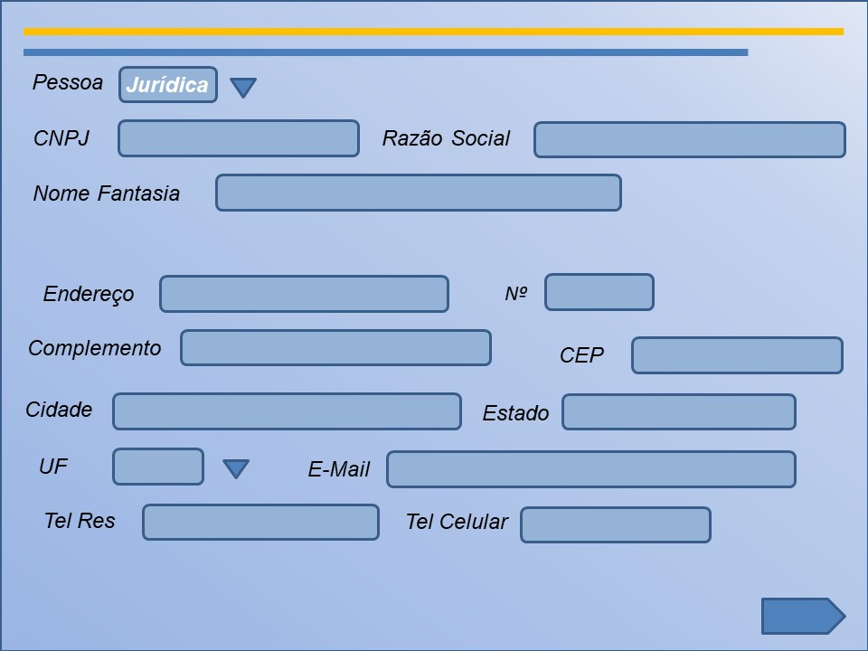
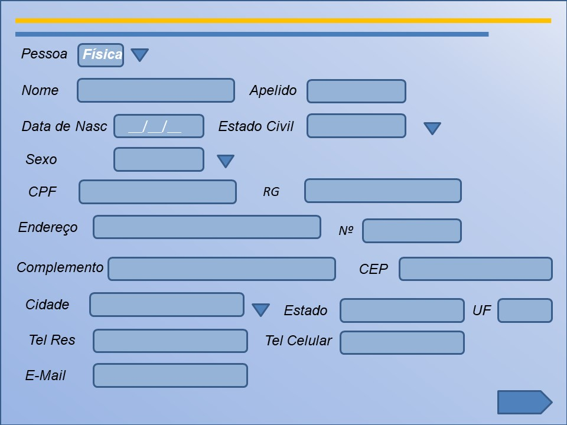
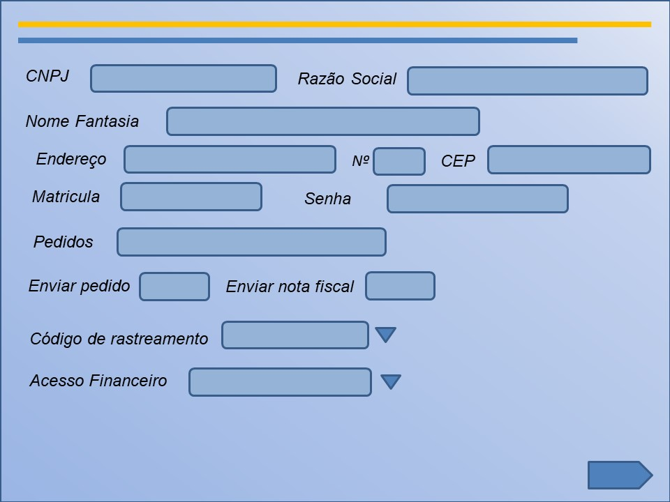
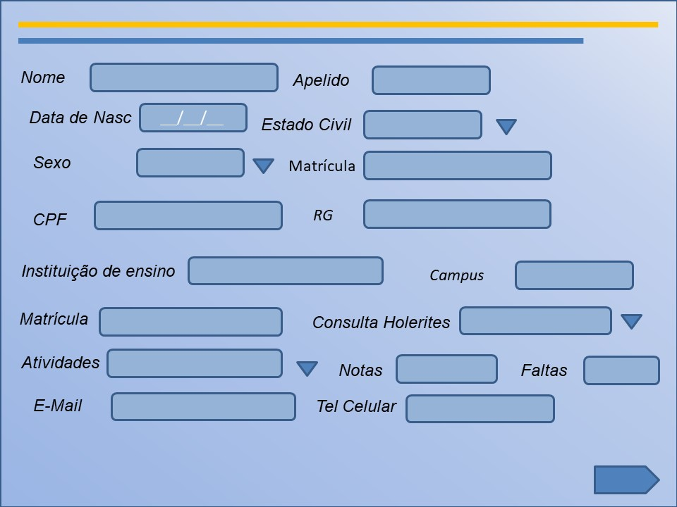

# Desenvolvimento-de-Sistemas-Orientado-a-Objetos

### Lista de Funcionalidades
- Gerenciamento de Disciplinas
    - Cadastrar Disciplina
    - Atualizar Disciplina
    - Consultar Disciplina

- Gerenciamento de Turmas
    - Criar Turma
    - Incluir Aluno
    - Definir Orientador

- Gerenciamento de Alunos
    - Matricular Aluno
    - Atualizar Dados do Aluno

- Gerenciamento de Professores
    - Registrar Professor
    - Atualizar Dados do Professsor

- Registro de Ponto
    - Registrar Ponto

- Gerenciamento de Fornecedores
    - Cadastrar Fornecedor
    - Atualizar Dados do Fornecedor

- Gerenciamento de Assistente
    - Definir Departamento
    - Consultar Departamento

- Gerenciamento de Pessoas Jurídicas
    - Cadastrar Pessoa Jurídica
    - Atualizar Dados da Pessoa Jurídica

- Gerenciamento de Pessoas Físicas
    - Cadastrar Pessoa Física
    - Atualizar Dados da Pessoa Física

- Gerenciamento de Usuários
    - Editar Perfil
    - Alterar Senha
    - Verificar Bloqueio

### MER  

Modelo Lógico:  

## Prototipação

## Cadastrar Pessoa Jurídica

## Cadastrar Pessoa Física

## Cadastrar Fornecedor

## Cadastrar Professor
